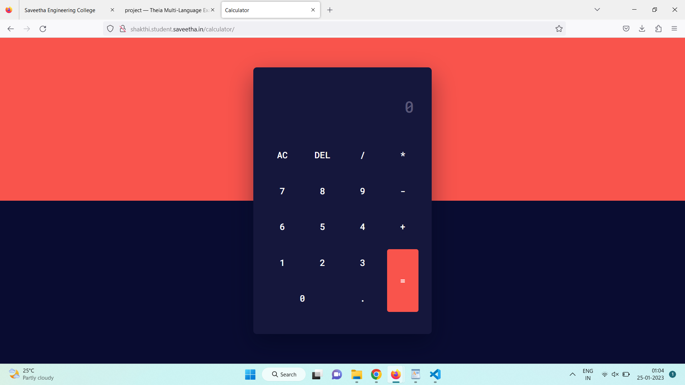
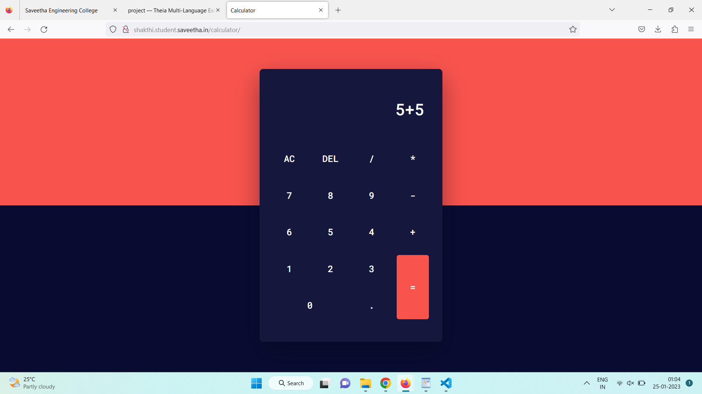

# Design of a Standard Calculator

## AIM:

To design a web application for a standard calculator.

## DESIGN STEPS:

### Step 1:
Clone the github repository and create Django admin interface.


### Step 2:
Change settings.py file to allow request from all hosts.


### Step 3:
Use CSS for creating attractive colors.


### Step 4:

Write JavaScript program for implementing five different operations.

### Step 5:
Validate the HTML and CSS code.

### Step 6:

Validate the HTML and CSS code.


## PROGRAM :
```
<!DOCTYPE html>
<html lang="en">
  <head>
    <meta name="viewport" content="width=device-width, initial-scale=1.0" />
    <title>Calculator</title>
    <!-- Google Font -->
    <link
      href="https://fonts.googleapis.com/css2?family=Roboto+Mono:wght@500&display=swap"
      rel="stylesheet"
    />
    <!-- Stylesheet -->
    <link rel="stylesheet" href="style.css" />
  </head>
  <style>
    * {
  padding: 0;
  margin: 0;
  box-sizing: border-box;
  font-family: "Roboto Mono", monospace;
}
body {
  height: 100vh;
  background: linear-gradient(to bottom, #f9544c 50%, #090c31 50%);
}
.calculator {
  width: 400px;
  background-color: #15173c;
  padding: 50px 30px;
  position: absolute;
  transform: translate(-50%, -50%);
  top: 50%;
  left: 50%;
  border-radius: 8px;
  box-shadow: 0 20px 50px rgba(0, 5, 24, 0.4);
}
.display {
  width: 100%;
}
.display input {
  width: 100%;
  padding: 15px 10px;
  text-align: right;
  border: none;
  background-color: transparent;
  color: #ffffff;
  font-size: 35px;
}
.display input::placeholder {
  color: #9490ac;
}
.buttons {
  display: grid;
  grid-template-columns: repeat(4, 1fr);
  grid-gap: 20px;
  margin-top: 40px;
}
.buttons input[type="button"] {
  font-size: 20px;
  padding: 17px;
  border: none;
  background-color: transparent;
  color: #ffffff;
  cursor: pointer;
  border-radius: 5px;
}
.buttons input[type="button"]:hover {
  box-shadow: 0 8px 25px #000d2e;
}
input[type="button"]#equal {
  grid-row: span 2;
  background-color: #f9544c;
}
input[type="button"][value="0"] {
  grid-column: span 2;
}  
  </style>
  <body>
    <div class="calculator">
      <div class="display">
        <input type="text" placeholder="0" id="input" disabled />
      </div>
      <div class="buttons">
        <!-- Full Erase -->
        <input type="button" value="AC" id="clear" />
        <!-- Erase Single Value -->
        <input type="button" value="DEL" id="erase" />
        <input type="button" value="/" class="input-button" />
        <input type="button" value="*" class="input-button" />
        <input type="button" value="7" class="input-button" />
        <input type="button" value="8" class="input-button" />
        <input type="button" value="9" class="input-button" />
        <input type="button" value="-" class="input-button" />
        <input type="button" value="6" class="input-button" />
        <input type="button" value="5" class="input-button" />
        <input type="button" value="4" class="input-button" />
        <input type="button" value="+" class="input-button" />
        <input type="button" value="1" class="input-button" />
        <input type="button" value="2" class="input-button" />
        <input type="button" value="3" class="input-button" />
        <input type="button" value="=" id="equal" />
        <input type="button" value="0" class="input-button" />
        <input type="button" value="." class="input-button" />
      </div>
    </div>
    <!-- Script -->
    <script>
        let equal_pressed = 0;
//Refer all buttons excluding AC and DEL
let button_input = document.querySelectorAll(".input-button");
//Refer input,equal,clear and erase
let input = document.getElementById("input");
let equal = document.getElementById("equal");
let clear = document.getElementById("clear");
let erase = document.getElementById("erase");

window.onload = () => {
  input.value = "";
};

//Access each class using forEach
button_input.forEach((button_class) => {
  button_class.addEventListener("click", () => {
    if (equal_pressed == 1) {
      input.value = "";
      equal_pressed = 0;
    }
    //display value of each button
    input.value += button_class.value;
  });
});

//Solve the user's input when clicked on equal sign
equal.addEventListener("click", () => {
  equal_pressed = 1;
  let inp_val = input.value;
  try {
    //evaluate user's input
    let solution = eval(inp_val);
    //True for natural numbers
    //false for decimals
    if (Number.isInteger(solution)) {
      input.value = solution;
    } else {
      input.value = solution.toFixed(2);
    }
  } catch (err) {
    //If user has entered invalid input
    alert("Invalid Input");
  }
});

//Clear Whole Input
clear.addEventListener("click", () => {
  input.value = "";
});
//Erase Single Digit
erase.addEventListener("click", () => {
  input.value = input.value.substr(0, input.value.length - 1);
});

    </script>
    
  </body>
</html>


```

## OUTPUT:
 ## without values:

## with values:



## validator:

## Result:
Result:

The program for designing a simple calculator using Javascript is executed successfully
